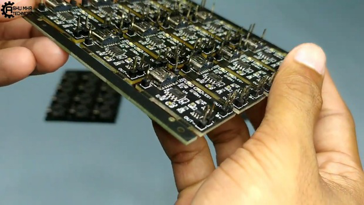

> Look , I\'m charging!

There are more than enough stories about batteries exploding due to
overcharging. Too much stress on a battery can lead to a chemical
reaction and boom! Your battery is history. With the DIY TP4056 Battery
Charging Module you won\'t need to worry about that happening because
this bad boy automatically shuts off once your battery is full.

The circuit is based on a highly efficient switching power supply
controlled with an output voltage of 5V and current up to 1000mA.

This project is designed to charge single cells Li-Ion/LiPo/LiFe with
protection against overcharge and short circuits, making it perfect for
DIY projects which require a reliable and safe charger.

> You will also get detailed instructions with pictures on how to build
> this project so anybody can do it in their own home. It might not seem
> like a big deal now but when your car is running out of juice, this
> project could save your life.

**Supplies:**

> TP4056 Module

> **Step 1: Get Your PCB Ready!**

**Talking about electronics.**

> After making the circuit diagram I transformed it into a PCB design to
> produce it, to produce the PCB, I have chosen the best PCB supplier
> and the cheapest PCB provider to order my circuit. with
> the reliable platform, all I need to do is some simple steps which we will
> talk later.

**Related Download Files**\
As you can see in the pictures above the PCB is very well manufactured
and I've got the same PCB assembled with all the components that we want
to use for our main board and all the labels and logos are there to
guide me during the soldering steps. You can also download the Gerber
file for this circuit from the download link below in case you want to
place an order for the same circuit design.

**Step 2: Comparing Generic TP4056 With Our JLCPCB Designed TP4056.**

> The Generic TP4056 has Micro-Usb port while our designed TP4056 has
> Type-C port , which is more convinient to use.
>
> The Generic TP4056 comes in Blue Colour while we can order our custom
> designed PCB in many colours.

> **Step 3: Soldering a SMD Component.**

**Soldering** a SMD Component.

**Step 4: Powering the TP4056 Module and Checking the Output Voltage.**

> Connect the Type-C cable to TP4056 Module.
>
> Checking the input voltage which is around 5 volts.\
> Checking the output voltage which is around 4.3 volts.
>
> So now, we can consider that our module is working.

**Step 5: Connecting and Charging the Battery.**

> Connect the battery +ve and -ve terminal to B+ and B- respectively.
>
> Checking the battery voltage.
>
> Powering our Module, red light indicates that the battery is charging.
>
> After some time, the green led glows which indicates that the battery
> is fully charged.

**Step 6: Ordering the PCB With JLCPCB SMT Assembly Service.**

> **Upload**

> Upload your Gerber, BOM&CPL files to get instant quote on PCB,
> components and assembly. **Assembly Prices start at**

**\$8.00 setup fee**, and \$0.0017 assembly fee per joint.

> **Order**
>
> A DFM analysis will be generated after you order the boards, allowing
> you to spot potential mistakes before it goes into production. You can
> also **track order status in real-time.**
>
> 
> 
> **Receive**
>
> By streamlining the entire process from ordering, parts sourcing and
> PCBA prototyping, you can get your products in hands **as fast as one
> week**
>
> **New users will also get some coupons while registering at [JLCPCB](https://jlcpcb.com/IYB) via this
> blue link.**
>
> **Thank you for reading this guide, hopefully**, **this guide provides
> full steps to help you to create your this guide provides full steps
> to help you to create your**

**ownTP4056 TP4056CHARGING CHARGINGMODULE. MODULE.If you have any
questions please post them in the comment section below.**

